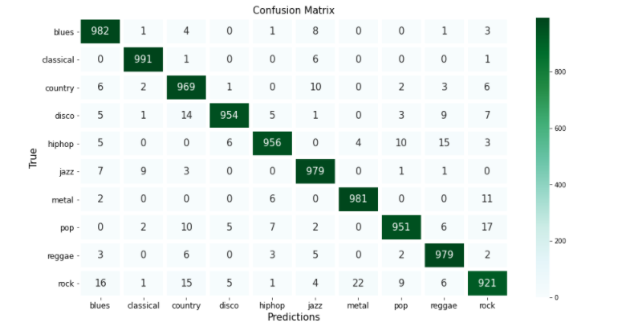

# Music Genre Classification
### Introduction
For my final capstone project, I decided to explore the wonderful world of music genre classification through machine learning. I purposely chose this topic because I wanted to take this opportunity to challenge myself to learn something new and to demonstrate how data science is truly an inter-disciplinary field.

As somone who casually enjoys listening to music and plays a few instruments here and there, learning all the fundamental of audio analysis was a whole new challenge in and of itself. That said, it was really amazing and inspiring to learn about all the intricate and complex dynamics that take place under the hood when we plug in our earphones and press play on our devices.

---

### Problem Statement
Music plays a critical role in our everyday lives. Companies like Spotify, Pandora, Apple, Google, and other major music platforms are constantly looking for new and fresh ways to categorize and classify a vast number of artists and genres based on users' taste and preference. Consequently, it is absolutely critical for companies to be able to manage their music inventory efficiently in order to connect with their customers more personally.

In this project, I set out to answer the question: **'Given a set of music audio samples. can I apply machine learning to predict their genres with a high level of accuracy?'**

---

### Data
For this project, I decided to use the GTZAN Genre Collection dataset. The dataset consists of 1,000 audio tracks. It is divided into 10 different genres, each represented by 100 tracks. Each track is 30 seconds long. These samples were collected between 2000-2001 from a variety of sources including personal CDs, radio, microphone recordings, and other sources in order to represent a vareity of recording conditions.

Source: http://marsyas.info/downloads/datasets.html

- - -

### Feature Extraction
Feature Extraction is a process of computing a compact numerical representation that can be used to characterize a segment of audio. For the purpose of this project, it is sufficient to note that the features basically represent the timbral texture, rhytmic features, and pitch content of any particular music audio sample.

Since the GTZAN Genre Collection dataset contains actual music audio samples, I had to perform my own feature extraction using a Python module called Librosa which is suitable for music/audio analysis and has feature extraction capabilities. 

- - - 
### Data Dictionary

|Feature|Type|Dataset|Description|
|---|---|---|---|
|**tempo_final**|float|final_df|Beats per minute
|**chroma_mean**|float|final_df|Mean of the 12-element representation of the spectral energy (12 different pitches)
|**chroma_mean**|float|final_df|Standard deviation of the 12-element representation of the spectral energy (12 different pitches)
|**mfccs_mean**|float|final_df|Mean of the Mel-frequency cepstral coefficients (cepstral representation of an audio clip on a mel-scale)
|**mfccs_std**|float|final_df|Standard deviation of the Mel-frequency cepstral coefficients (cepstral representation of an audio clip on a mel-scale)
|**s_centroid_mean**|float|final_df|Mean of the spectral centroid (center of mass of a given spectrum)
|**s_centroid_std**|float|final_df|Standard deivation of the spectral centroid (center of mass of a given spectrum)
|**s_centroid_skew**|float|final_df|Skewness of the spectral centroid (center of mass of a given spectrum)
|**s_contrast_mean**|float|final_df|Mean of the spectral contrast (measurement of spectral peak and valley in each sub-band)
|**s_contrast_mean**|float|final_df|Standard deviation of the spectral contrast (measurement of spectral peak and valley in each sub-band)
|**s_rolloff_mean**|float|final_df|Mean of the spectral rolloff (frequency below which the N% of the magnitude distribution is concentrated)
|**s_rolloff_std**|float|final_df|Stanndard deviation of the spectral rolloff (frequency below which the N% of the magnitude distribution is concentrated)
|**s_rolloff_skew**|float|final_df|Skewness of the spectral rolloff (frequency below which the N% of the magnitude distribution is concentrated)
|**z_cr_mean**|float|final_df|Mean of the zero-crossing rate (point in a digital audio file where the sample is at zero amplitude)
|**z_cr_mean**|float|final_df|Standard deviation of the zero-crossing rate (point in a digital audio file where the sample is at zero amplitude)
|**z_cr_mean**|float|final_df|Skewness of the zero-crossing rate (point in a digital audio file where the sample is at zero amplitude)
|**mel-spectrogram**|np array|df|representation of the signal strength, over a period of time at various frequencies

---
### Modeling

For this project, I decided incorporate three stages of modeling. First, I applied traditional classifiers such as Logistic Regression, KNN, Random Forests, SVM, Gradient Boost, and XGBoost using features that I extracted. 

Second, I derived what are known as Mel-Spectrograms for all the music audio samples, which are visual rerepresentation of sound. Mel-speectrograms can be treated like images so I fed these through a Convolutional Neural Network model.

Lastly, since music also contains sequential information over a duration of time, I applied a hybrid approach of combining convolutional layers and recurrent layers (GRU). Based on my research, this approach is becoming common in the field of voice, speech, and music recognition.

For the last two deep learning models, it's important to note that since 1,000 samples were not enough to train deep learning models, I had to create mini-samples by slicing each 30 sec sample into 10 separate 3 sec mini-samples. By doing so, I was able to expand my entire dataset from 1,000 samples to 10,000 samples.

----
# Evaluations

For this project, I decided to evaluate each model based on the accuracy score. The baseline accuracy score of 10% wasn't too difficult to outperform, so I decided to rank the models based on their accuracy scores with unseen test data.

After fitting all the models, it was evident that all the models suffered from high variance, some more so than others. Based on accuracy score discrepancy between training and testing data, KNN was the most overfit model with accuracy score close to 100%, but 62.4% with unseen test data. CRNN with dropout layers ended up being the best performer with 98.6% accuracy score with training data and 86.7% with unseen test data.

Using CRNN with dropout layers as my primary model, I thought it'd be interesting to see if there are any interesting trends in terms of which genre is misclassified the most.

Looking at the confusion matrix, I found that classical had the least numst of misclassifications whereas rock had the most number of misclassifications. Digging a little bit deeper into misclassifications within rock, I found that many were being misclassified as metal, blues, and country. After listening to the music audio samples, I found that some portions of the samples were "uncharacteristic" to a typical rock genre song and had a different feel and taste to them which suggests why the model may have misclassified them.

---
# Conclusions / Future Considerations

Working with raw music audio files, I leveraged a Python module Librosa to perform my own feature extraction. Using these features which are numerical representation of the samples, I ran various traditional classifiers such as Logistic Regression, KNN, Random Forests, SVM, Gradient Boost, and XGBoost. Out of these traditional classifiers, SVM was the best performer and scored 100% accuracy with training data and 72% accuracy with unseen testing data.

To incorporate deep learning models, I extracted Mel-Spectrograms for all the audio samples. However, since 1,000 music samples were not enough to train a deep learning model, I sliced each 30 sec sample into 10 separate chunks, each 3 seconds long. Since Mel-Spectrograms are essentially images, I created a Convolutional Neural Network model (with and without regularization for comparison purposes) and fed the images through the model.

Lastly, to implement a more hybrid approah that is gaining attraction in the field of voice, speech, and music recognition, I implemented a Convolutional Recurrent Neural Network model in which convolutional layers and recurrent layers (GRU) are combined together. CRNN model was able to achieve an accuracy score as high as 86.7% with unseen test data which was very promising. 

While investigating misclassifications for further insight and exploratory analysis, I found that misclassifications took place primarily due to the fact that certain music audio samples felt more like a blend of certain genres. This seems to suggest that learning sub-genres and/or music that doesn't necessarily fall "cleanly" to a certain genre may pose a difficult challenge. However, with more data and various applications of deep learning models, I believe this is a problem that can be properly addressed.

Here are some future considerations:

1. High variance observed across all models suggests that additional effort in regularization may be appropriate.

2. GTZAN Genre Collection dataset is about 20 years old. While genres don't deviate too wildly, music is definitely something that evolves over time. It'd be interesting to test this model against some recent music samples to see if there is any impact on its performance.

3. Another important question to consider is if music genre is something that will be relevant in years to come. Latest trend seems to be that we cluster music together based on artists we like to listen to rather than specific genres. I do think from a music inventory management standpoint, genre classification can still add a lot of value by enabling companies to undertand their customers and their taste/preference in music.

4. Upon further investigation, it was clear certain songs by nature do not fall "cleanly" into a particular genre. As a solution, it may be more appropriate to classify them as clusters of genres.